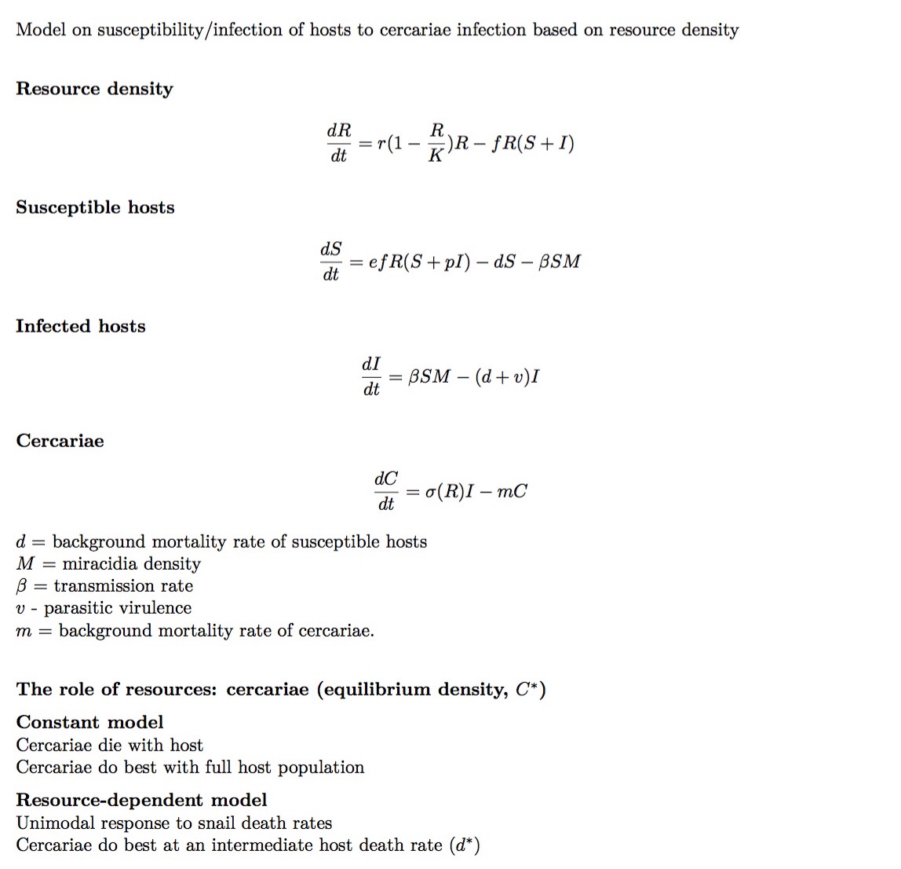

# Individual-based Dynamic Energy Budget *Schistosoma* model (SIDEB)  

      

## Matthew Malishev<sup>1*</sup> & David J Civitello<sup>1</sup>   

### _<sup>1</sup> Department of Biology, Emory University, 1510 Clifton Road NE, Atlanta, GA, USA, 30322_    

#### *Corresponding author: matthew.malishev [at] gmail.com     

## Overview    

Individual-based model (IBM) for *Schistosoma mansoni* parasite and *Biomphalaria spp.* snail host population interactions based on dynamic energy budget (DEB) and transmission model. The model outlines how resource use by a size-structured host population influences population cycles of hosts and parasites. Host and parasite ecology and energetics are captured using a mechanistic energy budget model and interactions among hosts and parasites are captured by a disease tranmission model. Resource use by hosts and thus parasites is modelled by the IBM.  

**Host**  
Hosts incur costs from infection through damage density _delta_ and cumulative hazard rate _H_.      

**Parasite**  
The number of free-living miracidia in the environment is based on a probability function (multinomial distribution) of surviving miracidia, miracidia that successfully infected hosts, and unsuccessful miracidia that died.       

*Files:*      

.R    
.html    
.pdf  
.nlogo    
.c  
.o  
.so  
.sh  

*Updates:*      

For `NetLogo` version updates, see the Info tab within the `NetLogo` file 'DEB_INF_GUTS_IBM.nlogo'.  
For `R` version updates, see the header within the `R` file 'DEB_IBM.R'.        

******  

## Running the simulation model  

Download the instructions for your operating system  

[**Windows**](https://github.com/darwinanddavis/SchistoIBM/tree/master/windows)  
[**Mac OSX**](https://github.com/darwinanddavis/SchistoIBM/tree/master/mac)  

## Parameters and variables   

### Individual 
Notation follows the standard DEB notation, except in the following aspects:  
- Rates are indicated with '_rate' rather than a dot  
- '_ee_' is scaled reserve density of hosts in `Netlogo`    

Table 1. Definitions of model parameters for individual hosts and **parasites**. Dimensions and units: -, dimensionless; cm, centimetres; d, days; J, joules; L, length.    

| Parameter | Definition | Dimension<br/>(unit) | Environment |    
| :---: | :--- | :---: | :--- |    
| _L_ | structural length | cm | `NetLogo` |      
| _ee_ | scaled reserve density | J (cm<sup>3</sup>) | `NetLogo` |  
| _D_ | host development | mg C | `NetLogo` |    
| _RH_ | energy in reproduction buffer| J | `NetLogo` |  
| _DAM_ | starvation-related damage | t (d<sup>-1</sup>) | `NetLogo` |  
| _HAZ_ | starvation-related hazard rate | t (d<sup>-1</sup>) | `NetLogo` |  
| _LG_ |  shell length | L (cm) | `NetLogo` |  
| age |  age of egg (hatches at 7 days) | t (d<sup>-1</sup>) | `NetLogo` |  
| **_P_** |  **parasite biomass** | **cm<sup>3</sup>** | **`NetLogo`** |    
| **_RPP_** |  **energy in parasite reproduction** | **J** | **`NetLogo`** |    


### Environment  

Table 2. Definitions of model parameters of the simulation model environment. Dimensions and units: N, number.    

| Parameter | Definition | Dimension<br/>(unit) | Environment |    
| :---: | :--- | :---: | :--- |  
| _F_ | periphyton (food) density| N | `NetLogo` |      
| _M_ | total number of miracidia | N | `NetLogo` |  
| _Z_ | cercarial density | N | `NetLogo` |    
| _G_ | total number of eggs | N | `NetLogo` |  

## Disease transmission model (resource-dependent cercariae production)  

                 

## Troubleshooting  
### :pig: For running Netlogo from `R` on Mac OSX. See the [Instructions for Mac OSX](https://github.com/darwinanddavis/SchistoIBM/tree/master/mac) page for a detailed breakdown of the troubleshooting steps.  
:one: [Installing compiler toolchain for Mac OSX](https://thecoatlessprofessor.com/programming/r-compiler-tools-for-rcpp-on-macos/)    
:two: if rJava error, run the following in terminal (src: https://stackoverflow.com/questions/30738974/rjava-load-error-in-rstudio-r-after-upgrading-to-osx-yosemite and #http://paulklemm.com/blog/2015-02-20-run-rjava-with-rstudio-under-osx-10-dot-10/):    
``` {bash}
sudo ln -s $(/usr/libexec/java_home)/jre/lib/server/libjvm.dylib /usr/local/lib 
```  
:three: For running java tests for Mac OSX, see the [**Instructions for Mac OSX**](https://github.com/darwinanddavis/SchistoIBM/tree/master/mac) documentation.     

## References  
[Civitello, D. J., Fatima, H. , Johnson, L. R., Nisbet, R. M., Rohr, J. R. and Ben‐Ami, F. (2018) Bioenergetic theory predicts infection dynamics of human schistosomes in intermediate host snails across ecological gradients. Ecol Lett, 21: 692-701](https://onlinelibrary.wiley.com/doi/abs/10.1111/ele.12937)  

## Maintainer  
**Matt Malishev**   
:mag: [Website](https://www.researchgate.net/profile/Matt_Malishev)    
:bird: [@darwinanddavis](https://twitter.com/darwinanddavis)  
:email: matthew.malishev [at] gmail.com      

